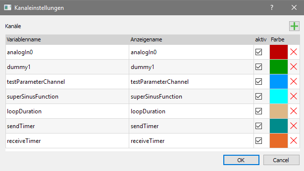
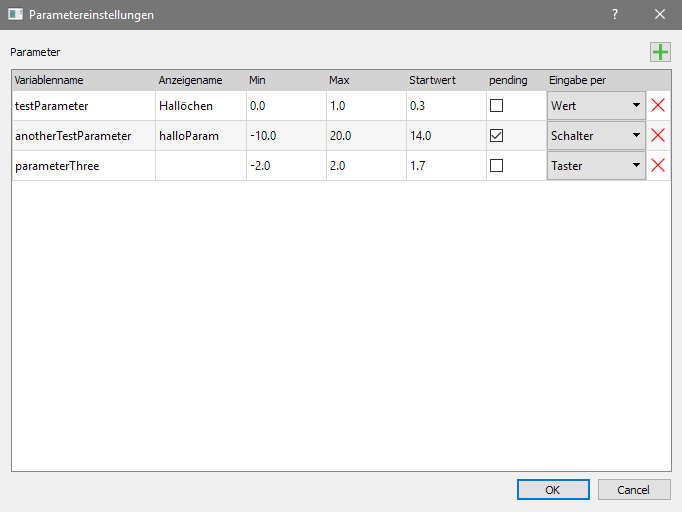

Create a microRay project
=========================

* Create a new microRay project under "Datei" -> "Neues Projekt...".

**First define some general settings**

* Go to "Bearbeiten" -> "Projekteinstellungen"
* The value entered in "Controller loop cycle time in Us" will always be available as "loopCycleTimeUs" in your
  controller code. See the example on the next page how it could be used. If you don't use this parameter in your code,
  enter a value, that is close to your expected loop cycle time, because the calculation of the initial scaling
  of the plot window is done based on this value.
* The path to the controller code folder is the place, where the include files will be generated.
  To avoid copying these files after a new code generation, specify a folder, that, for example, is the folder,
  where your microcontroller code resides.
* Specify the controller and interface you want to use.
* click Ok

**Then add channels**

* Go to "Bearbeiten" -> "Kanaleinstellungen"

* Click the green plus symbol in the upper right corner to add a variable,
  that will be send from the controller on every loop cycle.
* Edit the variable name and, if you like, its display name.
* Check the "active" checkbox, so that the variable will be transmitted.

.. note:: If "active" is selected off, the variable will not be transmitted on every cycle. But it is still defined in the
  include files, so that you don't have to change the parts of your code, where this variable is used. When,
  for example, you have defined too many channels to be transmitted just in the needed loop cycle time,
  you can safely deselect some channels without loosing reference to them in your code.

* If you like, you can also select a color for your channel by clicking on the given color.

.. warning:: The choosen variable names will be macros in the generated C-Code. Consider, that they might conflict
             with macros already defined somewhere else.

**You can also add parameters**

* Go to "Bearbeiten" -> "Parametereinstellungen"
* add a parameter, that allows you to set values from within microRay directly on the controller

