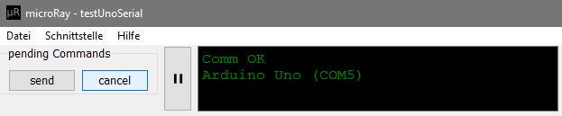
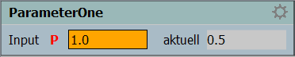
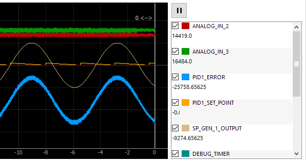

Using microRay
==============

The interface is splitted into three parts. The top most section is used for general things like starting or
stopping the communication and for displaying messages to the user.

The middle section is where your parameters are displayed.

The lowest section shows the live plot of your channel values arriving from the microcontroller.

General Control Panel
---------------------

The leftmost section in the general control panel is named "pending commands". If a command is in pending mode, the
new value, you entered, is not send to the controller immediately. Instead, all your inputs are collected and can be
send by clicking the send button. This might help, when you want to bring your system in a more complex state within
a short time. But the values are not send during one controller loop cylce. microRay uses a timer to send only one
command every certain interval, so that the controller doesn't get disturbed too much. But for most applications
this should work fine. When you made a wrong input to one parameter, just enter a new value. Only the last given value
of a parameter will be send to the controller. You can cancel all pending parameters by clicking the cancel button.

Then you have a play / pause button. This button triggers the connection to the controller fron the pc side. If you use
a serial connection, the com port will be closed or opened. If you use a Udp connection, the used socket will be closed
or opened.

The black message box informs about the actual state of the communication and gives failure messages, if applicable.

You will find one more message box on the right, that informs about parameter values send to the controller and other
information.

Parameter Section
-----------------

This is the input section for a single parameter.

Plot section
------------

If you own a mouse with a scroll wheel, position your mouse on the plot and rotate the scroll wheel to zoom.
If you only want to change the scale of one axis, position your mouse over the axis and then turn your scroll wheel.

.. note:: When you don't have a scroll wheel at your's disposal, right click on the plot area and select
 Mouse Mode -> One Button. Then you can zoom in by drawing a rectangle in the plot area and zoom out by right clicking
 and selecting "View All".

Use the play / pause button above the channel selection area to control the movement of the plot or the space key.

When you want to analyse a certain position,
just pause the movement, drag the white vertical line to the interesting region and zoom as you like. The value shown
next to the line is the actual time. The values of your channels at this time are shown in the channel selection area
on the right.

The play / pause button does not affect the communication with the controller, it keeps running in the background.

When you want to hide a channel from the plot, just deselect it in the channel selection area on the right. You don't
have to click on the checkbox, the whole area of one channel selects or deselects it. This selection does not affect
the channel from beeing transmitted from the controller or not.

.. note:: When you want the channel not to be transmitted, maybe because your loop cycle time is affected,
 deselect "active" under "Projekteinstellungen" -> "Kanaleinstellungen", generate the include files and recompile your code.

